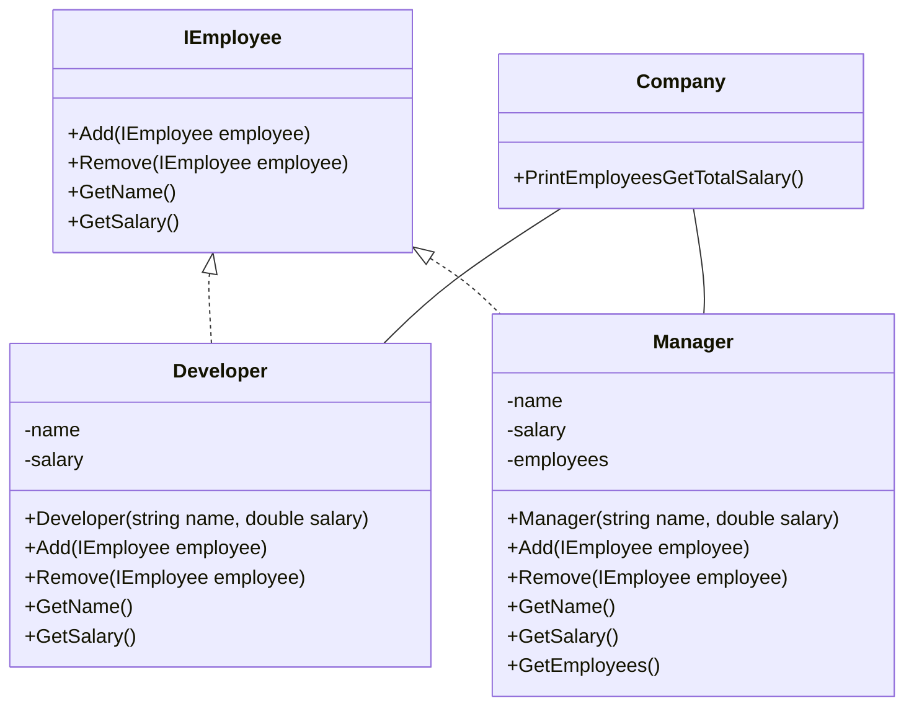

```mermaid
classDiagram
    IEmployee <|.. Developer
    IEmployee <|.. Manager
    Company -- Manager
    Company -- Developer
    IEmployee : +Add(IEmployee employee)
    IEmployee : +Remove(IEmployee employee)
    IEmployee : +GetName()
    IEmployee : +GetSalary()
    Developer : -name
    Developer : -salary
    Developer : +Developer(string name, double salary)
    Developer : +Add(IEmployee employee)
    Developer : +Remove(IEmployee employee)
    Developer : +GetName()
    Developer : +GetSalary()
    Manager : -name
    Manager : -salary
    Manager : -employees
    Manager : +Manager(string name, double salary)
    Manager : +Add(IEmployee employee)
    Manager : +Remove(IEmployee employee)
    Manager : +GetName()
    Manager : +GetSalary()
    Manager : +GetEmployees()
    Company : +PrintEmployeesGetTotalSalary()
```