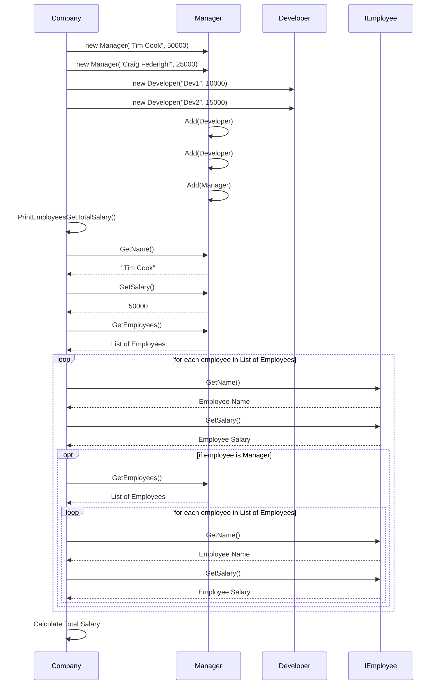

```mermaid
sequenceDiagram
    participant Company as Company
    participant Manager as Manager
    participant Developer as Developer
    Company->>Manager: new Manager("Tim Cook", 50000)
    Company->>Manager: new Manager("Craig Federighi", 25000)
    Company->>Developer: new Developer("Dev1", 10000)
    Company->>Developer: new Developer("Dev2", 15000)
    Manager->>Manager: Add(Developer)
    Manager->>Manager: Add(Developer)
    Manager->>Manager: Add(Manager)
    Company->>Company: PrintEmployeesGetTotalSalary()
    Company->>Manager: GetName()
    Manager-->>Company: "Tim Cook"
    Company->>Manager: GetSalary()
    Manager-->>Company: 50000
    Company->>Manager: GetEmployees()
    Manager-->>Company: List of Employees
    loop for each employee in List of Employees
        Company->>IEmployee: GetName()
        IEmployee-->>Company: Employee Name
        Company->>IEmployee: GetSalary()
        IEmployee-->>Company: Employee Salary
        opt if employee is Manager
            Company->>Manager: GetEmployees()
            Manager-->>Company: List of Employees
            loop for each employee in List of Employees
                Company->>IEmployee: GetName()
                IEmployee-->>Company: Employee Name
                Company->>IEmployee: GetSalary()
                IEmployee-->>Company: Employee Salary
            end
        end
    end
    Company->>Company: Calculate Total Salary
```